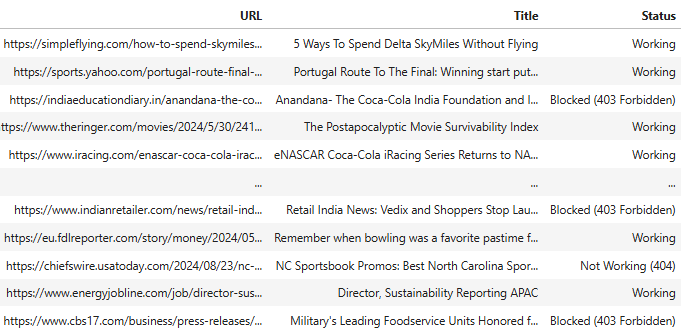

# 🧩 Broken Link Validator

A lightweight, multi-threaded Python tool for validating and classifying large batches of URLs from Excel files.  

This project automates the process of checking whether URLs in datasets are working, redirected, blocked, or broken — ideal for **data validation**, **media monitoring**, or **web scraping quality checks**.  

## 🚀 Features
- ✅ Bulk validation of URLs from Excel files  
- ⚡ Multi-threaded processing for faster execution  
- 🧠 Automatic classification:  
  - Working (Status 200)  
  - Redirected but Working (301/302)  
  - Blocked (403 Forbidden)  
  - Not Working (timeout or error)  
- 📊 Excel export with added status column  
- 🧾 Customizable & reproducible  

**Input:** Excel file containing a URL column
**Output:** Excel file with a new column Status showing each link’s result

## 💻 Usage
```bash
pip install pandas requests openpyxl
python broken_links.py
```

Example Output:



